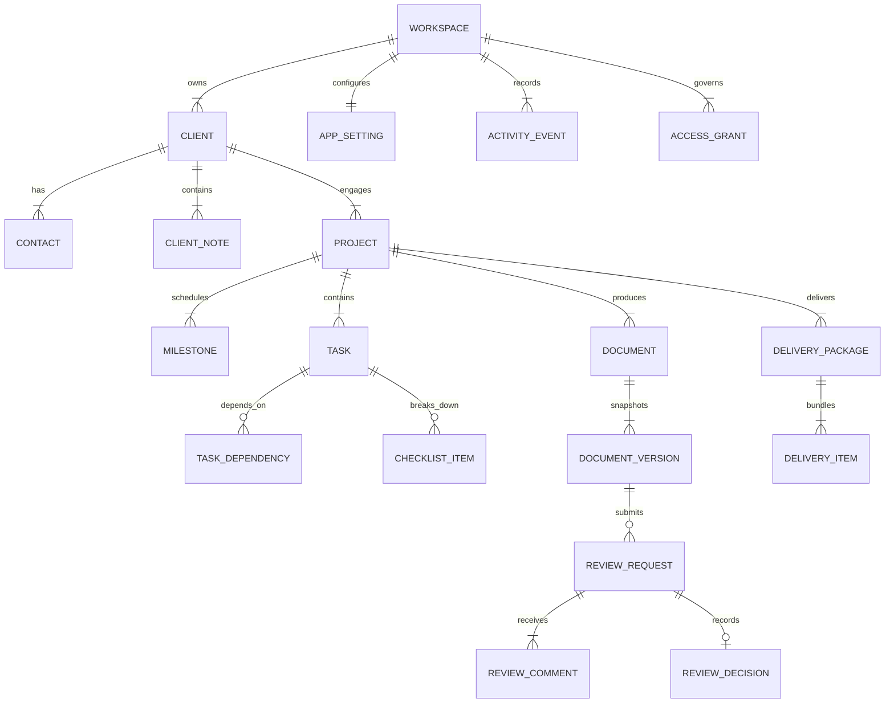

# CoreDesk — Data Model & Entity Specifications

> **Status:** IMPLEMENTED in Domain Model (`src/domain/types.ts`) / PARTIALLY MIGRATED to SQLite  
> **Last verified:** 2026-09-13  
> **Relevant source areas:** `apps/desktop/src/domain/types.ts`, `apps/desktop/src/state/store.tsx`, `database/migrations/`  
> **Owner domain:** Data Architecture  

---

## 1. Entity-Relationship Diagram

---

## 2. Canonical Entity Catalog

### 2.1 Workspace & Configuration

#### `Workspace` (`IMPLEMENTED`)
- **Purpose**: Root operational container for an independent practitioner's business.
- **Primary Key**: `id` (`string`)
- **Important Fields**: `name`, `ownerName`, `ownerEmail`, `timezone`, `services: ServiceDefault[]`, `business: { website, registration, logoLabel, accent }`, `proposalDefaults`.
- **Relationships**: Owns all Clients, Access Grants, and Activity Events.
- **Immutability Rules**: Mutable settings; audit events are appended when critical business details change.

#### `AppSetting` (`IMPLEMENTED in SQLite & React`)
- **Purpose**: Local key-value configuration for runtime preferences (theme, wallpaper, last route, view preferences).
- **Primary Key**: `key` (`string`)
- **Important Fields**: `value` (`string`), `updated_at` (`string`).
- **Storage**: `app_settings` table in SQLite (`0001_foundation_metadata.sql`) and browser storage.

---

### 2.2 Client Relationships

#### `Client` (`IMPLEMENTED`)
- **Purpose**: Ongoing commercial relationship that outlives any single engagement.
- **Primary Key**: `id` (`ClientId`, string)
- **Important Fields**: `name`, `state` (`prospect` | `active` | `inactive` | `archived`), `brandColor`, `website`, `industry`, `tier` (`retainer` | `fixed` | `hourly`), `totalBilled`, `currency`, `portalSlug`, `nextAction`, `nextActionTone`, `nextActionDue`, `lastActivity`, `privateNote`, `archivedOn`.
- **Foreign Keys**: `workspaceId` (root owner).
- **Relationships**: 1-to-many with `Contact`, `Project`, `ClientNote`.
- **Archive Behavior**: Archiving a client soft-deletes the client view by setting `state = 'archived'`. Archiving is blocked if active projects remain unclosed.
- **Derived Values**: `totalPipelineValue`, `activeWorkstreamsCount`, `openTasksCount`.

#### `Contact` (`IMPLEMENTED`)
- **Purpose**: Named stakeholder or decision-maker belonging to a client.
- **Primary Key**: `id` (`string`)
- **Important Fields**: `name`, `role`, `email`, `primary` (`boolean`).
- **Foreign Keys**: `clientId` (`ClientId`).
- **Relationships**: Referenced as reviewers in `ReviewRequest` and recipients in `DeliveryPackage`.

---

### 2.3 Project & Scope

#### `Project` (`IMPLEMENTED`)
- **Purpose**: A discrete, scoped commercial engagement with deliverables and deadlines.
- **Primary Key**: `id` (`ProjectId`, string)
- **Important Fields**: `name`, `code`, `outcome`, `stage` (`draft` | `planned` | `active` | `on-hold` | `in-review` | `delivered` | `closed` | `cancelled`), `type`, `budget`, `currency`, `progressPercent`, `due`, `brief`, `inScope: string[]`, `outOfScope: string[]`, `scopeAccepted: boolean`, `scopeAcceptedOn: string | null`, `startedOn: string | null`.
- **Foreign Keys**: `clientId` (`ClientId`).
- **Relationships**: 1-to-many with `Milestone`, `Task`, `Document`, `DeliveryPackage`.
- **Invariants**: One project belongs to exactly one client. Deleting or archiving a project never deletes the client.

#### `Milestone` (`IMPLEMENTED`)
- **Purpose**: Major progress and governance gate within a project schedule.
- **Primary Key**: `id` (`MilestoneId`, string)
- **Important Fields**: `name`, `due`, `done` (`boolean`).
- **Foreign Keys**: `projectId` (`ProjectId`).
- **Derived Values**: Status is `met` if `done === true`, `overdue` if past due date, otherwise `open`.

---

### 2.4 Tasks & Execution

#### `Task` (`IMPLEMENTED - FROZEN`)
- **Purpose**: Canonical atomic unit of operator production work.
- **Primary Key**: `id` (`TaskId`, string)
- **Important Fields**:
  - `title`: string
  - `projectId`: `ProjectId | null` (Tasks may precede project creation)
  - `clientId`: `ClientId | null`
  - `milestoneId`: `MilestoneId | null`
  - `due`: string (`YYYY-MM-DD`)
  - `status`: `TaskStatus` (`todo` | `in-progress` | `done` | `cancelled`) — **pure status only**
  - `attention`: `TaskAttention | null` (`waiting` | `blocked` | `overdue`) — **separate dimension**
  - `priority`: `TaskPriority` (`blocker` | `urgent` | `high` | `medium` | `low`)
  - `kind`: `TaskType` (`drafting` | `review` | `comms` | `delivery` | `admin`)
  - `estimatedMinutes`: number
  - `note`: string (Markdown/plain text)
  - `checklist`: `ChecklistItem[]`
  - `dependencies`: `TaskId[]` (Canonical prerequisite task IDs)
  - `blockedByTaskId`: `string` (Legacy single-blocker fallback)
  - `order`: number (Persistent integer for intra-column reordering)
  - `directLinkUrl`: string (Optional jump URL)
- **Relationships**: 1 canonical task record is projected across Home Focus Queue, Tasks Workspace Board/List, and Project Workspace Tasks tab.
- **Completion Invariants**: Cannot transition to `done` if any prerequisite in `dependencies` is incomplete. Completion logs exactly one `ActivityEvent`.

#### `TaskDependency` (`IMPLEMENTED`)
- **Purpose**: Many-to-many prerequisite dependency link between tasks.
- **Primary Key**: `id` (`string`)
- **Fields**: `taskId` (`TaskId`), `dependsOnTaskId` (`TaskId`).

---

### 2.5 Documents, Governance & Delivery

#### `DocumentRecord` (`IMPLEMENTED`)
- **Purpose**: High-level container for a versioned piece of client work.
- **Primary Key**: `id` (`DocumentId`, string)
- **Important Fields**: `title`, `type` (`Proposal` | `Brief` | `Agreement record` | `Welcome pack` | `Scope / Report` | `Notes` | `Deliverable`), `workingVersion` (`number`), `submittedVersion` (`number`), `reviewState` (`none` | `draft` | `waiting` | `changes-requested` | `approved` | `withdrawn` | `superseded`), `visibility` (`private` | `shared`), `sections: string[]`, `internalNote: string`, `modified: string`.
- **Foreign Keys**: `clientId` (`ClientId`), `projectId` (`ProjectId`).
- **Immutability Invariant**: Editing modifies `workingVersion`. Submitting creates an immutable `DocVersion` snapshot.

#### `DocVersion` (`IMPLEMENTED`)
- **Purpose**: Immutable snapshot of a document at the time of submission for client sign-off.
- **Primary Key**: `n` (`number`) scoped to `DocumentId`.
- **Important Fields**: `author`, `date`, `decision` (`approved` | `changes` | `null`), `note`.
- **Immutability Rule**: Once created and submitted, content and metadata cannot be edited.

#### `Review` / `ReviewRequest` (`IMPLEMENTED`)
- **Purpose**: Formal governance request dispatched to a client decision-maker to sign off on an exact version snapshot.
- **Primary Key**: `id` (`ReviewId`, string)
- **Important Fields**: `documentId`, `projectId`, `version` (`number`), `reviewer: { name, email, role }`, `requestedOn`, `due`, `state` (`ReviewState`), `outcome` (`Decision | null`), `decisionDate`, `feedbackSummary`.
- **Invariants**: Applies strictly to one exact version number (`version`). If changes are requested and the document is edited, a new version snapshot is required for subsequent review.

#### `DeliveryPackage` (`IMPLEMENTED`)
- **Purpose**: Final bundle of approved deliverables handed over to the client.
- **Primary Key**: `id` (`DeliveryId`, string)
- **Important Fields**: `title`, `state` (`missing-approval` | `ready` | `delivered` | `revoked`), `preparedOn`, `deliveredOn`, `items: DeliveryItem[]`, `downloadUrl`.
- **Delivery Gate Invariant**: Cannot be set to `ready` or `delivered` if referenced documents are unapproved.

---

### 2.6 Security & Access Grants

#### `AccessGrant` (`IMPLEMENTED in Domain / PLANNED in Token Engine`)
- **Purpose**: Scoped security authorization allowing external guests to view or review designated records.
- **Primary Key**: `id` (`GrantId`, string)
- **Important Fields**:
  - `recipientEmail`: string
  - `resourceType`: `'document'` | `'project'` | `'delivery'`
  - `resourceId`: string
  - `role`: `'Guest reviewer'` | `'Guest viewer'`
  - `tokenHash`: string
  - `expiresAt`: string
  - `state`: `'invited'` | `'active'` | `'verified'` | `'expired'` | `'revoked'`
- **Invariants**: Non-transitive. An access grant on Project P does not grant access to other projects under Client C. Revocation immediately denies further access.

---

### 2.7 Activity & Audit Trail

#### `ActivityEvent` (`IMPLEMENTED`)
- **Purpose**: Immutable chronological audit event recording significant operational transitions.
- **Primary Key**: `id` (`string`)
- **Important Fields**: `date`, `type` (`task` | `review` | `document` | `project` | `client`), `title`, `meta`, `entityId`, `actor`.
- **Append-Only Invariant**: Events are strictly append-only; they cannot be updated or deleted.
