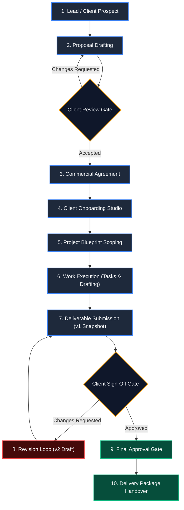

# CoreDesk — Client Lifecycle & Commercial Journey

> **Status:** IMPLEMENTED in State Workflows / Modeled from FigJam S1  
> **Last verified:** 2026-09-13  
> **Relevant source areas:** `CoreDesk-Product-Context.md`, `coredesk-app/src/domain/types.ts`  
> **Owner domain:** Commercial Workflows  

---

## 1. End-to-End Lifecycle Graph

---

## 2. Stage Breakdown & Gate Conditions

### 1. Lead / Client Prospect
- **Entry Criteria**: Inbound inquiry or prospective client identified.
- **Objects Created**: `Client` (state: `'prospect'`), initial `Contact`.
- **Exit Criteria**: Initial brief agreed; ready for formal commercial proposal.
- **Activity Generated**: `"Added prospective client '{name}'"`.

### 2. Proposal Drafting
- **Entry Criteria**: Client expresses intent to explore an engagement.
- **Objects Created**: `DocumentRecord` (type: `'Proposal'`), initial working draft.
- **Exit Criteria**: Proposal sent to client decision-maker.
- **Waiting State**: Operator waits for client feedback or commercial counter-proposal.

### 3. Commercial Agreement
- **Entry Criteria**: Proposal accepted. Scope, billing terms (Fixed / Retainer / Hourly), and rates finalized.
- **Objects Created**: `DocumentRecord` (type: `'Agreement record'`), initial milestone budgets.
- **Exit Criteria**: Agreement signed or confirmed. Client transitions from `'prospect'` to `'active'`.
- **Activity Generated**: `"Client '{name}' became an active client"`.

### 4. Client Onboarding Studio
- **Entry Criteria**: Agreement confirmed.
- **Objects Created**: Structured brand colors, decision-maker contact card, portal credentials, payment parameters.
- **Tooling**: Handled by the Apple-style slide-over **Client Onboarding Studio Drawer**.
- **Exit Criteria**: Onboarding checklist complete; ready to launch first engagement.

### 5. Project Blueprint Scoping
- **Entry Criteria**: Onboarding complete.
- **Objects Created**: `Project` (stage: `'planned'`), `Milestone[]` with due dates and financial budgets, scope boundaries (`inScope`, `outOfScope`).
- **Tooling**: Built via **CreateProjectScreen** using blueprints (Brand Identity, Web Experience, Advisory).
- **Exit Criteria**: Project scope accepted by operator and client; stage moves to `'active'`.

### 6. Work Execution (Tasks & Drafting)
- **Entry Criteria**: Project is `'active'`.
- **Objects Created**: `Task[]` with checklist items and prerequisite dependencies, draft `DocumentRecord` deliverables.
- **Loop**: Tasks move through `To Do` $\longrightarrow$ `In Progress` $\longrightarrow$ `Done`.
- **Blocker Handling**: Tasks with incomplete prerequisites are flagged `blocked` and cannot complete until dependencies clear.
- **Exit Criteria**: Milestone work completed; deliverables ready for formal client review.

### 7. Deliverable Submission
- **Entry Criteria**: Working document or asset complete.
- **Objects Created**: Immutable `DocVersion` snapshot (index $n$), `ReviewRequest` targeting version $n$.
- **Waiting State**: Operator is blocked from editing submitted version; waiting on client decision. Cockpit lists item in **Client Approvals & Blockers**.

### 8. Revision Loop
- **Trigger**: Client selects `"Changes Requested"` and leaves feedback comments.
- **Objects Created**: `ReviewDecision` (`changes`), working document version incremented ($n+1$).
- **Action**: Operator implements requested modifications on working draft.
- **Exit Criteria**: New draft finalized and re-submitted as version $n+1$.

### 9. Final Approval Gate
- **Trigger**: Client selects `"Approved"`.
- **Objects Updated**: `DocVersion` decision marked `approved`. `DocumentRecord.reviewState` set to `'approved'`.
- **Activity Generated**: `"Client approved {title} (v{n})"`.
- **Unlock**: Final deliverable asset is unlocked for packaging.

### 10. Delivery Package Handover
- **Entry Criteria**: All required milestone deliverables have reached `approved` state.
- **Objects Created**: `DeliveryPackage` with download URLs and receipt manifest.
- **Exit Criteria**: Package downloaded or confirmed by client. Project transitions to `'delivered'`.
- **Relationship Preservation**: Project marked delivered; Client remains `'active'` or `'inactive'`, preserving all historical dossiers.
