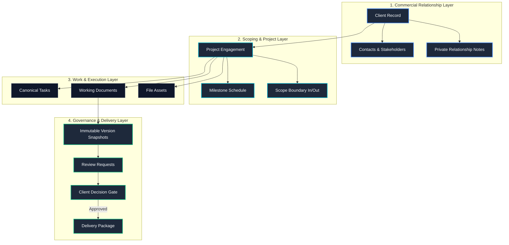

# CoreDesk — Product Architecture

> **Status:** IMPLEMENTED  
> **Last verified:** 2026-09-13  
> **Relevant source areas:** `coredesk-app/src/domain/types.ts`, `coredesk-app/src/state/db.ts`  
> **Owner domain:** Product Architecture  

---

## 1. High-Level Operational Hierarchy

CoreDesk models the complete operational universe of a professional practice as a strictly scoped tree. Nothing floats in isolation; all operational units derive meaning from their client and project context.

```
Workspace (1)
 ├── Professional Profile & Settings (1)
 ├── Universal Search & Command Palette (1)
 ├── Activity Stream (Audit Trail) (1)
 ├── Access Grants (Many)
 └── Clients (Many)
      ├── Contacts (Many)
      ├── Private Relationship Notes (Many)
      └── Projects (Many)
           ├── Milestones (Many)
           ├── Tasks (Many, Canonical Record)
           │    ├── Checklist Items (Many)
           │    └── Prerequisite Dependencies (Many-to-Many)
           ├── Documents (Many)
           │    └── Document Versions (Many, Immutable Snapshots)
           │         └── Review Requests (Many over time)
           │              └── Decisions (Approved | Changes Requested)
           ├── File Assets & References (Many)
           └── Delivery Packages (Many, Tied to Exact Approved Versions)
```

---

## 2. Core Functional Systems



---

## 3. Subsystem Breakdown & Interactions

### 3.1 Operator Cockpit (Morning Command Center)
The homepage aggregates cross-cutting relational intelligence across three core operational pillars:
1. **Client Approvals & Blockers**: Queries documents in `'waiting'` review state and projects blocked on external milestone approvals. Generates direct follow-up actions ("Ping client").
2. **Today's Focus Production Queue**: Queries tasks assigned to today's execution window, sorted by priority (`blocker`, `urgent`, `high`) with estimated completion minutes. Offers 1-click completion checkboxes and an inline fast-adder.
3. **Client Pulse & Commercial Runway**: Live financial and operational health cards displaying active workstream counts, billed revenue, and current relationship lifecycle phases.

### 3.2 Clients Master-Detail Relationship Workspace
- **Left Pane (40%)**: Scannable cards showing brand avatars, active workstream counters, and formatted pipeline revenue.
- **Right Pane (60%)**: Deep client dossier showing corporate identity, key decision-maker contact details, active projects with stage badges, open tasks, pending sign-offs, and private operator notes.
- **Client Onboarding Studio Drawer**: Slide-over drawer providing a comprehensive intake workflow covering brand details, commercial terms (fixed, retainer, hourly), and immediate launchpad actions.

### 3.3 Blueprint-Driven Project Scoping Studio
Accelerates project setup by pairing milestone scheduling with predefined engagement blueprints:
- **Brand Identity System**: Generates Discovery, Concept Directions, and Asset System Handover.
- **Design System & Web Experience**: Generates IA & Wireflows, Component Design System, and Production Build.
- **Strategic Advisory Retainer**: Generates recurring monthly execution sprints and quarterly strategy reviews.

### 3.4 Tasks Workspace
An operational dual-view (`Board` vs `List`) workspace:
- Uses a **single canonical `Task` record** shared across Home, Tasks Workspace, and Project Workspace.
- Supports dynamic pivot grouping by **Status**, **Attention**, **Priority**, **Milestone**, or **Project**.
- Enforces dependency blocking: tasks with incomplete prerequisite tasks (`dependencies?: TaskId[]`) cannot be dropped or toggled into `Done`.

### 3.5 Document Studio & Governance System
- Distinguishes strictly between the **working document** (mutable draft) and **submitted versions** (immutable snapshots).
- Handles multi-section content, version history comparison, and submission for client review.

### 3.6 Review & Delivery Pipeline
- **Guest Review Surface**: External stakeholders enter a focused, branded review portal to inspect document versions and submit structured decisions (`Approved` vs `Changes Requested` with comments).
- **Delivery Packaging**: Final client deliverables must reference exact approved version snapshots and verified file assets before packaging is unlocked.

### 3.7 Universal Search & Navigation Engine
Omnipresent `⌘K` / `Ctrl+K` palette querying clients, projects, tasks, and documents with instant keyboard navigation, category badging, and direct route jump links.

### 3.8 Local AI Engine (Atlas AI)
An isolated background service operating over Ollama for local LLM inference. Application features call the typed `TaskRouter`, which retrieves validated prompt templates from `PromptRegistry`, constructs scoped context, and validates structured outputs before returning data to the UI.
