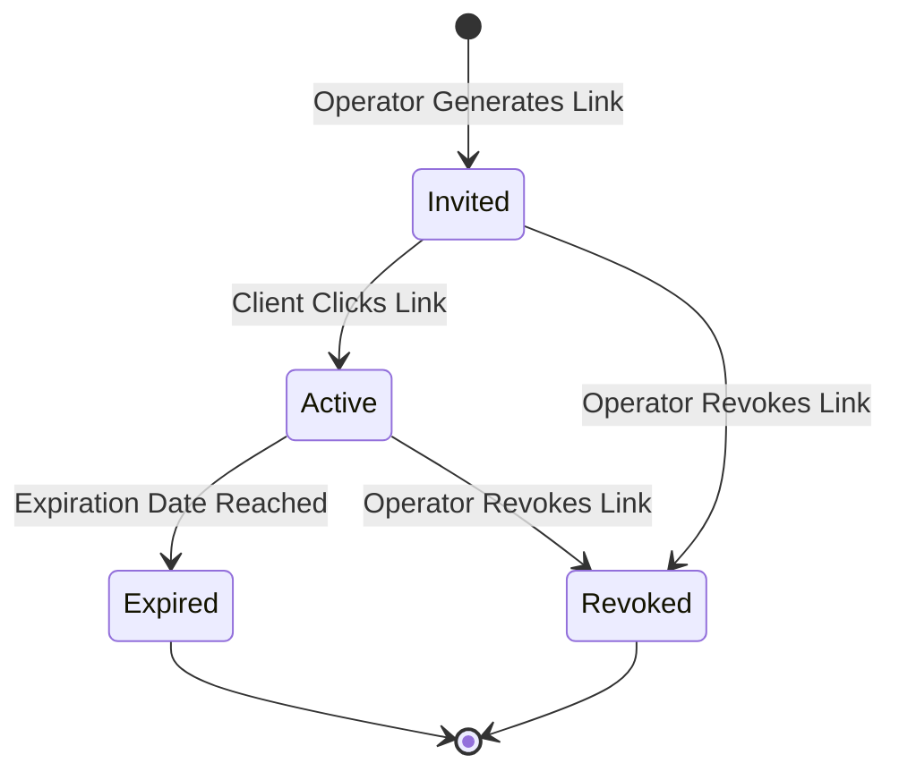

# CoreDesk — Access Control & Security Permissions Model

> **Status:** IMPLEMENTED in Domain Model (`AccessGrant`) / Token Verification `PLANNED`  
> **Last verified:** 2026-09-13  
> **Relevant source areas:** `coredesk-app/src/screens/ShareSetupScreen.tsx`, `coredesk-app/src/domain/types.ts`  
> **Owner domain:** Access Control & Information Security  

---

## 1. The Core Authorization Principle

CoreDesk enforces a zero-trust, scoped access grant model:
$$\text{Access Grant} = \text{Recipient} + \text{Resource} + \text{Role} + \text{Expiry} + \text{Revocation}$$

Every external access request must satisfy all five dimensions. If any parameter fails or expires, access is immediately denied.

---

## 2. Granular Role Definitions

| Role | Target Resource | Permitted Actions | Prohibited Actions |
|---|---|---|---|
| **Workspace Owner** | Entire Workspace | Full read, write, delete, export, archive, configure, and billing control. | None (Superuser of local installation). |
| **Guest Reviewer** | Single `DocVersion` | Read specified document version snapshot, submit formal decision (`approved` / `changes`), add review comments. | ❌ Read other document versions ❌ Edit working draft ❌ Access client dossier or tasks ❌ View financial terms |
| **Guest Viewer** | Single `DocumentRecord` or `DeliveryPackage` | Read-only view of shared document or download delivered asset bundle. | ❌ Submit decisions or approve ❌ Modify content ❌ View private notes |

---

## 3. What is NOT Inherited Automatically

> [!CAUTION]
> In CoreDesk, access is **strictly non-transitive and non-inherited**:
> 1. **No Client-Wide Access**: Granting a client contact review access to Project A's proposal does **NOT** grant access to Project B, other documents, or the client dossier.
> 2. **No Version Bleed**: Granting review access to Version 1 does **NOT** grant access to Version 2 working drafts.
> 3. **Private Notes are Always Redacted**: Operator notes (`client.privateNote`, `document.internalNote`) are strictly stripped from all guest payloads.
> 4. **No Lateral Navigation**: Guest views omit the sidebar rail, global top bar, breadcrumbs navigation, and search palette.

---

## 4. Lifecycle of an Access Grant

- **Revocation**: Clicking "Revoke Access" in `ShareSetupScreen.tsx` sets `grant.state = 'revoked'`. Subsequent visits to the link render a clean security denial: `"Access Revoked: Access to this review was revoked by the workspace owner."`
- **Expiration**: When `grant.expires` is earlier than the current date, the surface renders a clean `"Review Link Expired"` security notice.

---

## 5. Preview Routing Architecture (Current Local vs. Future Web)

- **Current Implementation**: Local hash-based routing (`#/preview/review?id={reviewId}` and `#/guest/review?id={reviewId}`) resolved directly through the canonical local SQLite / store access engine.
- **Future Implementation**: Signed browser guest links (`https://review.coredesk.app/v/{token}`) authenticated via time-limited asymmetric JWT/Paseto cryptographic signatures, redirecting into an isolated web guest container. Zero local data or operating system privileges are granted to external reviewers.
