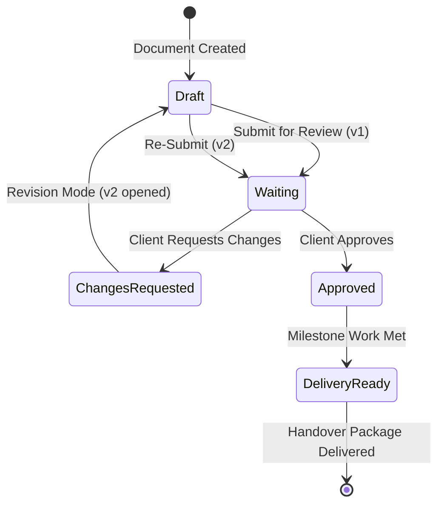

# CoreDesk — Review & Delivery Governance System

> **Status:** IMPLEMENTED in Domain Model & Screens / Token Verification `PARTIAL`  
> **Last verified:** 2026-09-13  
> **Relevant source areas:** `coredesk-app/src/screens/guest/GuestReviewScreen.tsx`, `coredesk-app/src/screens/guest/GuestDeliveryScreen.tsx`, `coredesk-app/src/domain/types.ts`  
> **Owner domain:** Client Governance & Delivery  

---

## 1. Review Governance Lifecycle

The review system provides structured, auditable client sign-off. It eliminates ambiguous email approvals by binding client decisions directly to immutable document version snapshots:



---

## 2. Review Request & Decision Mechanics

### 2.1 The Review Request (`Review`)
- Dispatched to a named client contact (`reviewer.email`).
- Strictly binds to an exact version number: `version: number`.
- Transitions `DocumentRecord.reviewState` to `'waiting'`.
- Lists the document in the Operator Cockpit under **Client Approvals & Blockers**.

### 2.2 Dual-Shell Review Architecture ("One Presentation, Two Shells")

CoreDesk maintains a single canonical review component—`GuestReviewSurface`—mounted in two operational contexts to prevent feature or behavioral drift:

1. **Owner In-App Preview (`OwnerGuestPreviewWorkspace`)**:
   - Resides inside the CoreDesk desktop application shell (`ShellFrame`).
   - Displays an owner-only preview toolbar (`OwnerPreviewToolbar`) with `Copy guest link`, `Open externally`, `Refresh`, and `Close preview` (returns to prior document/project context).
   - Allows the principal to simulate the client experience without leaving the operating system context.

2. **External Client Guest Surface (`ExternalGuestReviewScreen`)**:
   - Minimal standalone guest view with `MinimalGuestHeader`.
   - Strictly omits sidebar, workspace switchers, command bar, internal notes, tasks, and sibling documents.

### 2.3 Structural Components of `GuestReviewSurface`
- **Exact Version Guarantee Banner**: Explicitly binds to the exact immutable `DocVersion` snapshot requested (e.g. `v3`), stating: *"You are reviewing v{version} — the exact version sent for review. This version cannot change underneath you."* Advancing working drafts to subsequent versions never mutates the active review.
- **Continuous Reading Canvas**: Editorial document canvas (720–850px reading measure) flowing through all document sections, clear-space diagrams, and color swatch palettes without artificial SaaS card boundaries.
- **Structured Review Inspector**: Unified right-hand inspector rail (320–380px) containing:
  1. *Reviewer & Version Metadata*: Contact identity, role, exact snapshot version, and due date.
  2. *Decision Controls*: "Approve v{version}" (unlocks delivery pipeline) and "Request changes" (strictly requires an explanation comment before accepting the decision).
  3. *Comments Thread*: Chronological feedback thread with immediate posting and store synchronization.
  4. *Access Scope Summary*: Role, expiration date, and zero-trust data protection notice.

---

## 3. Delivery Packaging & Handover

### 3.1 Eligibility Gate
> [!IMPORTANT]
> **Delivery Eligibility Invariant**: A `DeliveryPackage` cannot transition to `ready` or be handed over if any referenced deliverable is unapproved or in a pending review state.

```
[ All Deliverables Approved? ]
      │
      ├── NO  ──► Status: 'missing-approval' (Packaging Locked)
      │
      └── YES ──► Status: 'ready' (Packaging Unlocked)
                       │
                       ▼
                 [ Generate Package ] ──► Status: 'delivered'
```

### 3.2 Delivery Package Structure (`DeliveryPackage`)
- **Title & Identifier**: `id` (`DeliveryId`), `title` (e.g. `"Brand Identity Final Asset Handover"`).
- **Items (`DeliveryItem[]`)**: Exact approved document versions (`DocVersion`) and file assets (`FileAsset`) with SHA-256 integrity checksums.
- **Client Delivery Portal (`GuestDeliveryScreen.tsx`)**: Secure download landing page allowing the client to download packaged archives and sign off on final receipt.
- **Historical Audit**: Once delivered, the package record remains permanently archived under the client and project dossier.
