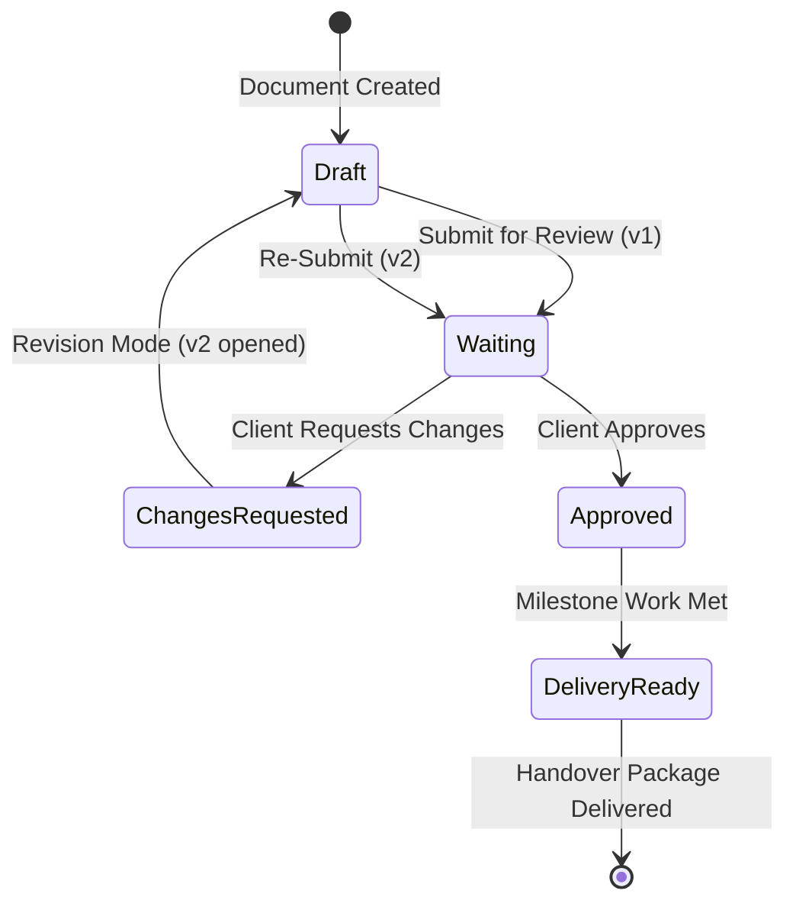

# CoreDesk — Review & Delivery Governance System

> **Status:** IMPLEMENTED in Domain Model & Screens / Token Verification `PARTIAL`  
> **Last verified:** 2026-09-13  
> **Relevant source areas:** `coredesk-app/src/screens/guest/GuestReviewScreen.tsx`, `coredesk-app/src/screens/guest/GuestDeliveryScreen.tsx`, `coredesk-app/src/domain/types.ts`  
> **Owner domain:** Client Governance & Delivery  

---

## 1. Review Governance Lifecycle

The review system provides structured, auditable client sign-off. It eliminates ambiguous email approvals by binding client decisions directly to immutable document version snapshots:



---

## 2. Review Request & Decision Mechanics

### 2.1 The Executive Review Transmission Studio (`ShareSetupScreen.tsx`, `#/share?document=:id`)
To ensure submissions are dispatched with executive polish, CoreDesk provides a structured 5-step transmission studio rather than a basic form:

1. **Step 1: Version & Snapshot Confirmation**:
   - Explicitly displays the active mutable working draft version (e.g. `v1`) and warns that dispatch freezes the document into an immutable snapshot `v2`.
   - Re-confirms that in-flight edits cannot alter historical reviews or mutate approved baselines.
2. **Step 2: Recipient, Authority Level & Turnaround SLA**:
   - Preset selector for primary client decision-makers (e.g. Marta Velasco, Dr. Aris Thorne).
   - **Authority Level Selection**:
     - `Designated Approver`: Grants sole binding authority to formally approve deliverables or trigger revision cycles.
     - `Collaborator / Contributor`: Allows contextual feedback and annotations without gating delivery packages.
   - **Turnaround SLA Chips**: Fast presets (`3 Days - Expedited`, `5 Days - Standard`, `7 Days - Thorough`, `14 Days - Enterprise`) auto-calculating due dates.
3. **Step 3: Executive Cover Message**:
   - Fast cover letter presets for common agency situations:
     - *Proposal Submission*: Framing strategic scope, investment levels, and immediate next steps.
     - *Milestone Deliverable*: Guiding the reviewer to specific sections and review criteria.
     - *Concept Review*: Framing creative exploration and directional alignment.
   - Editable custom cover message that renders directly in both the client email dispatch and the top of the guest review portal.
4. **Step 4: Presentation Template Selection**:
   - Allows the principal to choose between 3 tailored document aesthetics:
     - `executive` (**Executive Editorial**): Serif headers, warm ivory canvas, formal crest.
     - `modern-studio` (**Modern Studio Showcase**): Minimalist grotesque typography, high-contrast monochrome accents.
     - `enterprise` (**Enterprise Formal**): Corporate technical typography, metadata headers, audit badges.
5. **Step 5: Studio Portfolio Attachment**:
   - Instant portfolio inclusion toggle (`includePortfolio: true`).
   - Case study checklist selecting which studio flagship achievements to feature alongside the review (e.g. Harbor & Finch, Verity Health, Atlas Logistics).

### 2.2 Live Client Experience Preview
Alongside the 5-step form, the studio renders a real-time **Client Experience Preview** simulating:
- **Transactional Client Notification Email**: Accurate preview of the delivery email from `Anas Ayari <anas@northlight.studio>`, complete with studio header seal, recipient greetings, custom cover letter, review CTA button, and studio portfolio attachment pill.
- **Guest Portal Mini Preview**: Showing the reviewer exactly how the document header, authority banner, and portfolio showcase will appear upon opening the review link.

### 2.3 Dual-Shell Review Architecture ("One Presentation, Two Shells")

CoreDesk maintains a single canonical review component—`GuestReviewSurface`—mounted in two operational contexts to prevent feature or behavioral drift:

1. **Owner In-App Preview (`OwnerGuestPreviewWorkspace`)**:
   - Resides inside the CoreDesk desktop application shell (`ShellFrame`).
   - Displays an owner-only preview toolbar (`OwnerPreviewToolbar`) with `Copy guest link`, `Open externally`, `Refresh`, and `Close preview` (returns to prior document/project context).
   - Allows the principal to simulate the client experience without leaving the operating system context.

2. **External Client Guest Surface (`ExternalGuestReviewScreen`)**:
   - Minimal standalone guest view with `MinimalGuestHeader`.
   - Strictly omits sidebar, workspace switchers, command bar, internal notes, tasks, and sibling documents.

### 2.4 Structural Components of `GuestReviewSurface`
- **Exact Version Guarantee Banner**: Explicitly binds to the exact immutable `DocVersion` snapshot requested (e.g. `v3`), stating: *"You are reviewing v{version} — the exact version sent for review. This version cannot change underneath you."* Advancing working drafts to subsequent versions never mutates the active review.
- **Transmission Cover Note**: Prominently highlights the personalized message sent by the agency principal to provide context and guidance.
- **Dynamic Presentation Template Styling**: Applies `.cd-template-executive`, `.cd-template-modern-studio`, or `.cd-template-enterprise` typography and layout rules.
- **Studio Portfolio Showcase Drawer**: An expandable, beautifully organized Northlight Studio credentials showcase featuring:
  - Studio summary, founding year, delivered client metrics (+38% recognition, 5.4M intake users, <200ms latency).
  - Selected case study cards (Harbor & Finch, Verity Health, Atlas Logistics) with executive testimonials from client leadership.
- **Continuous Reading Canvas**: Editorial document canvas (720–850px reading measure) flowing through all document sections, clear-space diagrams, and color swatch palettes without artificial SaaS card boundaries.
- **Structured Review Inspector**: Unified right-hand inspector rail (320–380px) containing:
  1. *Reviewer & Version Metadata*: Contact identity, role, exact snapshot version, and due date.
  2. *Decision Controls*: "Approve v{version}" (unlocks delivery pipeline) and "Request changes" (strictly requires an explanation comment before accepting the decision).
  3. *Comments Thread*: Chronological feedback thread with immediate posting and store synchronization.
  4. *Access Scope Summary*: Role, expiration date, and zero-trust data protection notice.

---

## 3. Delivery Packaging & Handover

### 3.1 Eligibility Gate
> [!IMPORTANT]
> **Delivery Eligibility Invariant**: A `DeliveryPackage` cannot transition to `ready` or be handed over if any referenced deliverable is unapproved or in a pending review state.

```
[ All Deliverables Approved? ]
      │
      ├── NO  ──► Status: 'missing-approval' (Packaging Locked)
      │
      └── YES ──► Status: 'ready' (Packaging Unlocked)
                       │
                       ▼
                 [ Generate Package ] ──► Status: 'delivered'
```

### 3.2 Delivery Package Structure (`DeliveryPackage`)
- **Title & Identifier**: `id` (`DeliveryId`), `title` (e.g. `"Brand Identity Final Asset Handover"`).
- **Items (`DeliveryItem[]`)**: Exact approved document versions (`DocVersion`) and file assets (`FileAsset`) with SHA-256 integrity checksums.
- **Client Delivery Portal (`GuestDeliveryScreen.tsx`)**: Secure download landing page allowing the client to download packaged archives and sign off on final receipt.
- **Historical Audit**: Once delivered, the package record remains permanently archived under the client and project dossier.
